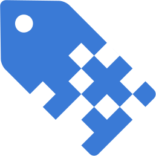

<p align="center"></p>

<h1 align="center">Digital Products</h1>

This plugin makes it possible to sell licenses for digital products with [Craft Commerce](https://craftcms.com/commerce).

## Requirements

Digital Products requires Craft 3.1.20 and Craft Commerce 2.1.0 or later.

## Installation

You can install this plugin from the Plugin Store or with Composer.

#### From the Plugin Store

Go to the Plugin Store in your project’s Control Panel and search for “Digital Products”. Then click on the “Install” button in its modal window.

#### With Composer

Open your terminal and run the following commands:

```bash
# go to the project directory
cd /path/to/my-project.test

# tell Composer to load the plugin
composer require craftcms/digital-products

# tell Craft to install the plugin
./craft install/plugin digital-products
```

## Events

### The `beforeSaveProductType` and `afterSaveProductType` events

Plugins can be notified right before or right after a product type is saved in case your plugin needs to do something at that point:

```php
use craft\digitalproducts\events\ProductTypeEvent;
use craft\digitalproducts\services\ProductTypes;
use yii\base\Event;

// ...

Event::on(ProductTypes::class, ProductTypes::EVENT_BEFORE_SAVE_PRODUCTTYPE, function(ProductTypeEvent $e) {
    // Some custom code to be executed when a product type is saved
});
```

### The `beforeGenerateLicenseKey` event

Plugins get a chance to provide a license key instead of relying on Digital Products to generate one.

```php
use craft\digitalproducts\elements\License;
use craft\digitalproducts\events\GenerateKeyEvent;
use craft\digitalproducts\Plugin as DigitalProducts;
use yii\base\Event;

// ...

Event::on(License::class, License::EVENT_GENERATE_LICENSE_KEY, function(GenerateKeyEvent $e) {
    do {
        $licenseKey = // custom key generation logic...
    } while (!DigitalProducts::getInstance()->getLicenses()->isLicenseKeyUnique($licenseKey));

    $e->licenseKey = $licenseKey;
});
```

## Eager loading

Both licenses and products have several eager-loadable properties

### Licenses

* `product` - Allows you to eager-load the product associated with the license.
* `order` - Allows you to eager-load the order associated with the license, if any.
* `owner` - Allows you to eager-load the Craft user that owns the license, if any.

### Products
* `existingLicenses` - Eager-loads all the existing licenses for the currently logged in Craft User.

## Examples

### Displaying the licensed product for the currently logged in Craft User.

```twig

    

    <div class="panel panel-default">
    <div class="panel-heading"><h3 class="panel-title">Licenses</h3></div>
    
        <table class="table">
            <thead>
                <tr>
                    <th>Licensed product</th>
                    <th>License date</th>
                    <th>Order</th>
                </tr>
            </thead>
            <tbody>
            
                <tr>
                    <td><a href="{{ license.product.getUrl() }}">{{ license.product.title }}</a></td>
                    <td>{{ license.dateCreated|date('Y-m-d H:i:s') }}</td>
                    <td>
                        
                            <a href="/store/order?number={{ license.order.number }}">Order no. {{ license.orderId }}</a>
                        
                    </td>
                </tr>
            
            </tbody>
        </table>
    

    <p>Please log in first</p>

```

### Checking if currently logged in user is licensed to access a product.

```twig


    <table class="table">
        <thead>
            <tr>
                <th>Product</th>
                <th>License status</th>
            </tr>
        </thead>
        <tbody>
            
                <tr>
                    <td>{{ product.title }}</td>
                    <td>
                        
                            You already own this product.
                        
                            <a href="{{ product.getUrl() }}">Get it now!</a>
                        
                    </td>
                </tr>
            
        </tbody>
    </table>

```
